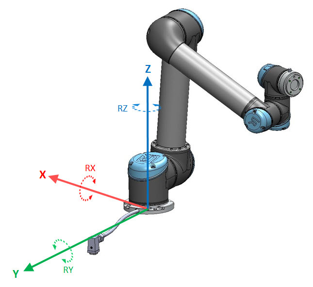

# Project Name
UR(Universal Robots) Robot & RG Gripper Util Code  (Python Code)

## Description
This code has three directories    

- get_state : Read values from UR
- control_ur : Set values to move UR
- control_gripper : Read & Set values to move RG Grippper

## Installation
Step-by-step instructions on how to get the development environment running.

```bash
# Install dependencies
pip install --user ur_rtde
pip install pymodbus
pip install numpy
```


## UR coordinates

<figure style="text-align: center;">
    
</figure>

## Usage
`Descriptions based on the directories`

**[control_ur] Set values to move UR**
- `move_joints.py`
    - set joints value to move UR joints
    - api : `rtde_c.moveJ(q_path)`
        - input : (joint positions, speed, acceleration, blend)
            - q: joint positions [rad]
            - speed: joint speed of leading axis [rad/s]
            - acceleration: joint acceleration of leading axis [rad/s^2]
            - blend : blend radius (smoothly transition between two trajectories)
- `move_endeffector.py`
    - set end-effector position value to move UR joints
    - api : `rtde_c.moveL(p_path)`
        - input : (pose,speed,acceleration,blend)
            - pose: target pose [m]
            - speed: tool speed [m/s]
            - acceleration: tool acceleration [m/s^2]
            - blend : blend radius (smoothly transition between two trajectories)

**[get_state] Read values from the UR**
- `get_joint_pos.py`
    - read positions of the joints from the UR
    - api : `rtde_r.getActualQ()`
        - output : (q1, q2, q3, q4, q5, q6) [rad]
- `get_endeffector_pose.py`
    - read xyz positions(cartesian coordinates) and xyz rotations of the end-effector from the UR
    - api : `rtde_r.getActualTCPPose()`
        - output : (x,y,z,rx,ry,rz)
            - x, y, z : [meter]
            - rx, ry, rz : [rad]

**[control_gripper] Set values to control RG gripper**
- `control_gripper.py`
    - close/open/move RG gripper
    - use modbus communication
    - api : `open_gripper`, `close_gripper`
        - input : force
    - api : `move_gripper`
        - input : width, force

## Acknowledgements
- UR document : https://sdurobotics.gitlab.io/ur_rtde/introduction/introduction.html
- RG2 gripper datasheet : https://www.universal-robots.com/media/1226143/rg2-datasheet-v14.pdf

## License
- The root directory is licensed under the MIT License (Copyright 2025, Seungmin Kim).
- The `rg_gripper` package is based on the work by Takuya Kiyokawa and retains its original MIT License.